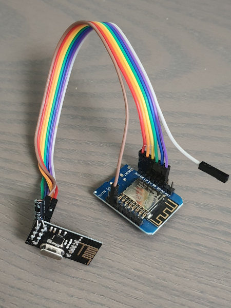

Proof-of-concept example how to send button presses to Simagic Alpha wheelbases from a Wemos D1 microcontroller with nRF24 wireless module.

Should be openable with Arduino IDE 1.x. Needs RF24 library to compile.

If you are using a clone chip you most likely need to uncomment SIMAGIC_NO_ACKS define from simagic.h, or try the [ACK workaround here](..) 

More information in the [root](..) 

